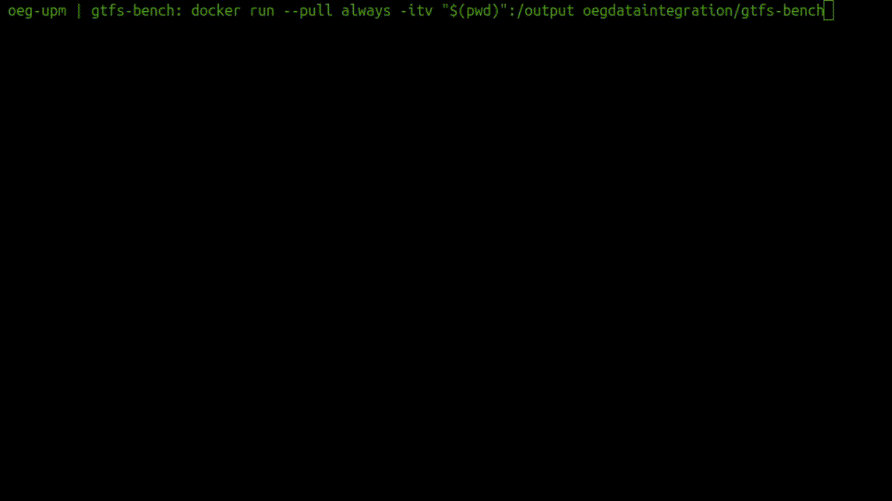

# The GTFS-Madrid-Bench

We present GTFS-Madrid-Bench, **a benchmark to evaluate declarative KG construction engines** that can be used for the provision of access mechanisms to (virtual) knowledge graphs. Our proposal introduces several scenarios that aim at measuring performance and scalability as well as the query capabilities of all this kind of engines, considering their heterogeneity. The datasources used in our benchmark are derived from the [GTFS](https://developers.google.com/transit/gtfs) data files of the subway network of Madrid. They can be transformed into several formats (CSV, JSON, SQL and XML) and scaled up. The query set aims at addressing a representative number of SPARQL 1.1 features while covering usual queries that data consumers may be interested in.

### Main Publication:
David Chaves-Fraga, Freddy Priyatna, Andrea Cimmino, Jhon Toledo, Edna Ruckhaus, & Oscar Corcho (2020). GTFS-Madrid-Bench: A benchmark for virtual knowledge graph access in the transport domain. Journal of Web Semantics, 65. [Online](https://doi.org/10.1016/j.websem.2020.100596)


## Requirements for the use:

To have locally installed [docker](https://docs.docker.com/engine/install/).


## Using Madrid-GTFS-Bench:

1. Run `docker run --pull always -itv "$(pwd)":/output oegdataintegration/gtfs-bench`
2. Choose data scales and formats to obtain the distributions you want to test. Example:



3. Result will be available as `result.zip` in the current working directory. The folders structure are: one folder for datasets and other for the queries (for virtual KG). Inside the datasets folder will be one folder for each distribution (e.g., csv, sql, custom), and in each distribution folder we provide the required sizes (each size in one folder), the corresponding mapping associated to the distribution, and the SQL schemes if they are needed. See the following example:

```
.
├── datasets
│   ├── csv
│   │   ├── 1
│   │   │   ├── AGENCY.csv
│   │   │   ├── CALENDAR.csv
│   │   │   ├── CALENDAR_DATES.csv
│   │   │   ├── FEED_INFO.csv
│   │   │   ├── FREQUENCIES.csv
│   │   │   ├── ROUTES.csv
│   │   │   ├── SHAPES.csv
│   │   │   ├── STOPS.csv
│   │   │   ├── STOP_TIMES.csv
│   │   │   └── TRIPS.csv
│   │   ├── 2
│   │   │   ├── AGENCY.csv
│   │   │   ├── CALENDAR.csv
│   │   │   ├── CALENDAR_DATES.csv
│   │   │   ├── FEED_INFO.csv
│   │   │   ├── FREQUENCIES.csv
│   │   │   ├── ROUTES.csv
│   │   │   ├── SHAPES.csv
│   │   │   ├── STOPS.csv
│   │   │   ├── STOP_TIMES.csv
│   │   │   └── TRIPS.csv
│   │   ├── 3
│   │   │   ├── AGENCY.csv
│   │   │   ├── CALENDAR.csv
│   │   │   ├── CALENDAR_DATES.csv
│   │   │   ├── FEED_INFO.csv
│   │   │   ├── FREQUENCIES.csv
│   │   │   ├── ROUTES.csv
│   │   │   ├── SHAPES.csv
│   │   │   ├── STOPS.csv
│   │   │   ├── STOP_TIMES.csv
│   │   │   └── TRIPS.csv
│   │   └── mapping.csv.nt
│   ├── json
│   │   ├── 1
│   │   │   ├── AGENCY.json
│   │   │   ├── CALENDAR_DATES.json
│   │   │   ├── CALENDAR.json
│   │   │   ├── FEED_INFO.json
│   │   │   ├── FREQUENCIES.json
│   │   │   ├── ROUTES.json
│   │   │   ├── SHAPES.json
│   │   │   ├── STOPS.json
│   │   │   ├── STOP_TIMES.json
│   │   │   └── TRIPS.json
│   │   ├── 2
│   │   │   ├── AGENCY.json
│   │   │   ├── CALENDAR_DATES.json
│   │   │   ├── CALENDAR.json
│   │   │   ├── FEED_INFO.json
│   │   │   ├── FREQUENCIES.json
│   │   │   ├── ROUTES.json
│   │   │   ├── SHAPES.json
│   │   │   ├── STOPS.json
│   │   │   ├── STOP_TIMES.json
│   │   │   └── TRIPS.json
│   │   ├── 3
│   │   │   ├── AGENCY.json
│   │   │   ├── CALENDAR_DATES.json
│   │   │   ├── CALENDAR.json
│   │   │   ├── FEED_INFO.json
│   │   │   ├── FREQUENCIES.json
│   │   │   ├── ROUTES.json
│   │   │   ├── SHAPES.json
│   │   │   ├── STOPS.json
│   │   │   ├── STOP_TIMES.json
│   │   │   └── TRIPS.json
│   │   └── mapping.json.nt
│   └── sql
│       ├── 1
│       │   ├── AGENCY.csv
│       │   ├── CALENDAR.csv
│       │   ├── CALENDAR_DATES.csv
│       │   ├── FEED_INFO.csv
│       │   ├── FREQUENCIES.csv
│       │   ├── ROUTES.csv
│       │   ├── SHAPES.csv
│       │   ├── STOPS.csv
│       │   ├── STOP_TIMES.csv
│       │   └── TRIPS.csv
│       ├── 2
│       │   ├── AGENCY.csv
│       │   ├── CALENDAR.csv
│       │   ├── CALENDAR_DATES.csv
│       │   ├── FEED_INFO.csv
│       │   ├── FREQUENCIES.csv
│       │   ├── ROUTES.csv
│       │   ├── SHAPES.csv
│       │   ├── STOPS.csv
│       │   ├── STOP_TIMES.csv
│       │   └── TRIPS.csv
│       ├── 3
│       │   ├── AGENCY.csv
│       │   ├── CALENDAR.csv
│       │   ├── CALENDAR_DATES.csv
│       │   ├── FEED_INFO.csv
│       │   ├── FREQUENCIES.csv
│       │   ├── ROUTES.csv
│       │   ├── SHAPES.csv
│       │   ├── STOPS.csv
│       │   ├── STOP_TIMES.csv
│       │   └── TRIPS.csv
│       └── mapping.sql.nt
└── queries
    ├── q10.rq
    ├── q11.rq
    ├── q12.rq
    ├── q13.rq
    ├── q14.rq
    ├── q15.rq
    ├── q16.rq
    ├── q17.rq
    ├── q18.rq
    ├── q1.rq
    ├── q2.rq
    ├── q3.rq
    ├── q4.rq
    ├── q5.rq
    ├── q6.rq
    ├── q7.rq
    ├── q8.rq
    └── q9.rq
```


## Resources

Additionally to the generator engine, that provides the data at desirable scales and distributions, together with corresponding mappings and queries, there are also common resources openly available to be modified or used by any practicioner or developer:

- Folder [mappings](https://github.com/oeg-upm/gtfs-bench/tree/master/mappings) contains RML mappings for CSV, XML, JSON and RDB distributions of the input GTFS dataset, R2RML mapping for RDB and xR2RML mapping for MongoDB. It also includes CSVW annotations for the CSV distributions.
- Folder [queries](https://github.com/oeg-upm/gtfs-bench/tree/master/queries) includes 18 queries with different levels of complexity including a representative set of SPARQL 1.1. operators. Additionally, the folder contains [11 simple queries](https://github.com/oeg-upm/gtfs-bench/tree/master/queries/simple) that will help to test the basic capabilities of virutal KG construction engines (i.e., to understand if the engine is able to translate correctly the SPARQL operators over different GTFS distributions before starting to test performance and scalability).

## Utils

Our experiences testing (virtual) knowledge graph engines have revealed the difficulties for setting up an infrastructure where many variables and resources are involved: databases, raw data, mappings, queries, data paths, mapping paths, databases connections, etc. For that reason, and in order to facilitate the use of the benchmark to any developer or practitioner, we provide a set of [utils](https://github.com/oeg-upm/gtfs-bench/tree/master/utils) such as docker-compose templates or evaluation bash scripts that, in our opinion, can reduce the time for preparing the testing set up.

## Desirable Metrics:

We highly recommend that (virutalizers or materializers) KG construction engines tested with this benchmark provide (at least) the following metris:
- Total execution time
- Number of answers	
- Initial delay	
- Dief@k (only for continuous/streaming behavior)*	
- Dief@t (only for continuous/streaming behavior)*

For virtual knowledge graphs systems, we also encourage developers and tester to provide:
- Loading time	
- Mapping translation time (if applies)
- Number of requests
- Source selection time	
- Query generation (or disitribution) time
- Query rewritting time
- Query translation time
- Query exececution time
- Results aggregation time

*R Package available at: https://github.com/dachafra/dief (extension from https://github.com/maribelacosta/dief)

## Data License
All the datasets generated by this benchmark have to follow the license of the Consorcio Regional de Transporte de Madrid: https://www.crtm.es/licencia-de-uso?lang=en

## Contribute
We know that there are variables and dimensions that we did not take into account in the current version of the benchmark (e.g., transformation function defined in the mapping rules). If you are interested in collaborate with us in a new version of the benchmark, send us an email or open a new [discussion](https://github.com/oeg-upm/gtfs-bench/discussions)!


## Authors

- David Chaves-Fraga - [dchaves@fi.upm.es](mailto:dchaves@fi.upm.es)
- Freddy Priyatna
- Jhon Toledo
- Daniel Doña
- Edna Ruckhaus
- Andrea Cimmino
- Oscar Corcho

Ontology Engineering Group, October 2019
